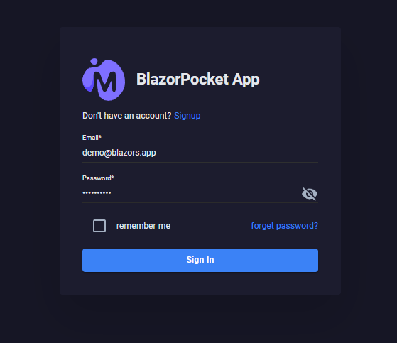

# BlazorPocket

[](https://github.com/neozhu/BlazorPocketApp/actions/workflows/dotnet.yml)
[](https://github.com/neozhu/BlazorPocketApp/actions/workflows/docker-image.yml)


created a shared library and a webassembly standalone template for MudBlazor and for the default blazor project.
the idea is just to use the pockethost.io to connect the blazor app to the backend, and then everything is working.
so new users can simply:

create a project using this webassembly standalone template
create an account and instance in pockethost.io
configure the url in the appsettings
and configure an automatic deploy to azure app service
and it is done, the use achived to create an app 100% free, without hosting costs.
also azure static web app allows custom domain with no additional cost (ofcorse you have to own a domain name first).
check my deploy, that was exactly the steps I listed here:
https://zealous-ocean-019afa910-preview.centralus.5.azurestaticapps.net/

and this is the app with default template, pointing to the same pockethost instance
https://happy-moss-0bb0d6110-preview.centralus.5.azurestaticapps.net

is your app template, but it is simply pointing to my instance in pockethost (that I just created few hours ago, very simple)

note that the avatar image is a fish, and the product overview is pointing to the page Counter (just to test the webassembly)

on appsettings.json,
"PocketbaseUrl": "https://blazorwasm-app1-api.pockethost.io"


BlazorPocket is a lightweight web application template that leverages the latest .NET 8.0 Blazor Web App with InteractiveAuto render mode and PocketBase for backend data storage. This project aims to streamline the development process, minimize repetitive coding, and provide a quick start for building efficient web applications.


<p>



</p>

## Features
- **Blazor Web App with .NET 8.0**: Utilizes the latest features and improvements in .NET 8.0 Blazor.
- **InteractiveAuto Render Mode**: Offers enhanced interactivity and responsiveness.
- **PocketBase Integration**: Simple and efficient data storage solution with PocketBase.
- **Quick Setup**: Pre-configured to reduce setup time and repetitive coding.

## Getting Started

### Demo
- https://blazorpocket.blazors.app

### docker compose file
```sh
version: '3.8'
services:
  blazorpocketapp:
    image: blazordevlab/blazorpocketapp:0.0.6-pre.73720a4
    environment:
      - UseInMemoryDatabase=false
      - ASPNETCORE_ENVIRONMENT=Development
      - ASPNETCORE_URLS=http://+:80;https://+:443
      - ASPNETCORE_HTTP_PORTS=80
      - ASPNETCORE_HTTPS_PORTS=443
      - AppSetting__AppName='${AppName}'
      - AppSetting__Version='${Version}'
      - AppSetting__ProcketbaseUrl='${ProcketbaseUrl}'   
    ports:
      - "8023:80"
      - "8024:443"
  pocketbase:
    image: blazordevlab/blazorpocketbase:0.0.5
    ports:
      - "8025:8080"
    volumes:
      - pocketbase_data:/pb/pb_data 
volumes:
  pocketbase_data:


```

### Prerequisites
- [.NET 8.0 SDK](https://dotnet.microsoft.com/download/dotnet/8.0)
- [PocketBase](https://pocketbase.io/)
- [Node.js](https://nodejs.org/) (for front-end development)

### Installation


1. **Clone the repository:**
    ```sh
    git clone https://github.com/neozhu/BlazorPocket.git
    cd BlazorPocket
    ```
    
2. **Add PocketBaseClient subtree:**
    ```sh
    git subtree add --prefix pbcodegen https://github.com/iluvadev/PocketBaseClient.git main --squash
    ```

3. **Add PocketBase C# SDK subtree:**
    ```sh
    git subtree add --prefix sdk https://github.com/iluvadev/pocketbase-csharp-sdk.git master --squash
    ```

3. **Setup PocketBase:**
    - Download and run PocketBase following the [official documentation](https://pocketbase.io/docs/).
    - Configure the PocketBase instance and make note of the endpoint URL.
    - pocketbase default admin and password
    ```sh
    admin@blazors.app
    admin12345!
    ```
    - login with demo and password
    ```sh
    demo@blazors.app
    demo12345!
    ```

4. **Configure the Blazor App:**
    - Update the configuration file in the Blazor project to point to your PocketBase instance.

5. **Restore .NET dependencies:**
    ```sh
    dotnet restore
    ```

6. **Build and run the Blazor App:**
    ```sh
    dotnet run
    ```

### Usage
- Open your browser and navigate to `https://localhost:5001`.
- You should see the BlazorPocket application running.
- Explore the sample components and understand the integration with PocketBase.

## Project Structure
- **/BlazorPocket.Client**: Contains the Blazor WebAssembly project.
- **/BlazorPocket.Server**: Contains the ASP.NET Core server project.
- **/BlazorPocket.Shared**: Contains shared code and models.

## Contributing
Contributions are welcome! Please feel free to submit issues, fork the repository, and send pull requests.

1. Fork the repository.
2. Create a new feature branch (`git checkout -b feature/your-feature`).
3. Commit your changes (`git commit -m 'Add your feature'`).
4. Push to the branch (`git push origin feature/your-feature`).
5. Create a new Pull Request.

## License
This project is licensed under the MIT License. See the [LICENSE](LICENSE) file for details.

## Acknowledgements
- [.NET Team](https://dotnet.microsoft.com/) for creating an amazing development framework.
- [PocketBase Team](https://pocketbase.io/) for providing a simple and efficient backend solution.

