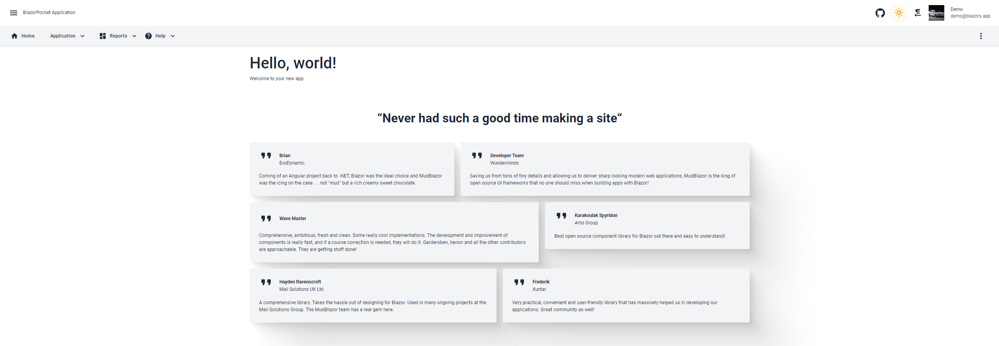

# BlazorPocket

[](https://github.com/neozhu/BlazorPocketApp/actions/workflows/dotnet.yml)
[](https://github.com/neozhu/BlazorPocketApp/actions/workflows/docker-image.yml)
[](https://github.com/neozhu/BlazorPocketApp/actions/workflows/github-page.yml)

BlazorPocket is a streamlined web application template built with the latest .NET 9.0 Blazor WebAssembly and PocketBase for backend data storage. Designed to simplify the development process and reduce repetitive coding, BlazorPocket provides a quick and efficient starting point for building modern web applications. With its WebAssembly mode, the application can be deployed on any server, offering flexible hosting options, whether on free hosting services or cloud platforms. This makes it easy to set up and run your web applications anywhere.




<p>


</p>

## Features

- **Blazor WebAssembly**: Utilizes .NET 9.0 Blazor WebAssembly for client-side web development, allowing for a rich, interactive user experience.
- **PocketBase Integration**: Seamlessly integrates with PocketBase for backend data storage, providing a robust and scalable data solution.
- **Streamlined Development**: Reduces repetitive coding tasks, enabling faster development and deployment of web applications.
- **Cross-Platform Deployment**: The WebAssembly mode allows the application to be deployed on any server, offering flexibility to host on free services or cloud platforms.
- **Shared Codebase**: Includes a shared code and models project, facilitating code reuse between the client and server parts of the application.
- **Quick Start Template**: Provides a ready-to-use template, helping developers get started quickly with a solid foundation for their web applications.

## Getting Started

### Demo
- https://blazorpocket.blazors.app

### docker compose file
```sh
version: '3.8'
services:
  blazorpocketapp:
    image: blazordevlab/blazorpocketapp:0.0.19-pre.3494121
    environment:
      - UseInMemoryDatabase=false
      - ASPNETCORE_ENVIRONMENT=Development
      - ASPNETCORE_URLS=http://+:80;https://+:443
      - ASPNETCORE_HTTP_PORTS=80
      - ASPNETCORE_HTTPS_PORTS=443
      - AppSetting__AppName='${AppName}'
      - AppSetting__Version='${Version}'
      - AppSetting__ProcketbaseUrl='${ProcketbaseUrl}'   
    ports:
      - "8023:80"
      - "8024:443"
  pocketbase:
    image: blazordevlab/blazorpocketbase:0.0.5
    ports:
      - "8025:8080"
    volumes:
      - pocketbase_data:/pb/pb_data 
volumes:
  pocketbase_data:


```

### Prerequisites
- [.NET 9.0 SDK](https://dotnet.microsoft.com/download/dotnet/9.0)
- [PocketBase](https://pocketbase.io/)
- [Node.js](https://nodejs.org/) (for front-end development)

### Installation


1. **Clone the repository:**
    ```sh
    git clone https://github.com/neozhu/BlazorPocket.git
    cd BlazorPocket
    ```
    
2. **Add PocketBaseClient subtree:**
    ```sh
    git subtree add --prefix pbcodegen https://github.com/iluvadev/PocketBaseClient.git main --squash
    ```

3. **Add PocketBase C# SDK subtree:**
    ```sh
    git subtree add --prefix sdk https://github.com/iluvadev/pocketbase-csharp-sdk.git master --squash
    ```

3. **Setup PocketBase:**
    - Download and run PocketBase following the [official documentation](https://pocketbase.io/docs/).
    - Configure the PocketBase instance and make note of the endpoint URL.
    - pocketbase default admin and password
    ```sh
    admin@blazors.app
    admin12345!
    ```
    - login with demo and password
    ```sh
    demo@blazors.app
    demo12345!
    ```

4. **Configure the Blazor App:**
    - Update the configuration file in the Blazor project to point to your PocketBase instance.

5. **Restore .NET dependencies:**
    ```sh
    dotnet restore
    ```

6. **Build and run the Blazor App:**
    ```sh
    dotnet run
    ```

### Usage
- Open your browser and navigate to `https://localhost:5001`.
- You should see the BlazorPocket application running.
- Explore the sample components and understand the integration with PocketBase.

## Project Structure
- **/PocketBaseClient.BlazorPocket**: Generated by pbcodegen, this project includes the client-side code for interacting with Pocketbase.
- **/BlazorPocket.WebAssembly**: Main WebAssembly application, responsible for running the client-side Blazor code in the browser.
- **/BlazorPocket.Shared**: Contains shared code and models.

## Contributing
Contributions are welcome! Please feel free to submit issues, fork the repository, and send pull requests.

1. Fork the repository.
2. Create a new feature branch (`git checkout -b feature/your-feature`).
3. Commit your changes (`git commit -m 'Add your feature'`).
4. Push to the branch (`git push origin feature/your-feature`).
5. Create a new Pull Request.

## License
This project is licensed under the MIT License. See the [LICENSE](LICENSE) file for details.

## Acknowledgements
- [.NET Team](https://dotnet.microsoft.com/) for creating an amazing development framework.
- [PocketBase Team](https://pocketbase.io/) for providing a simple and efficient backend solution.

